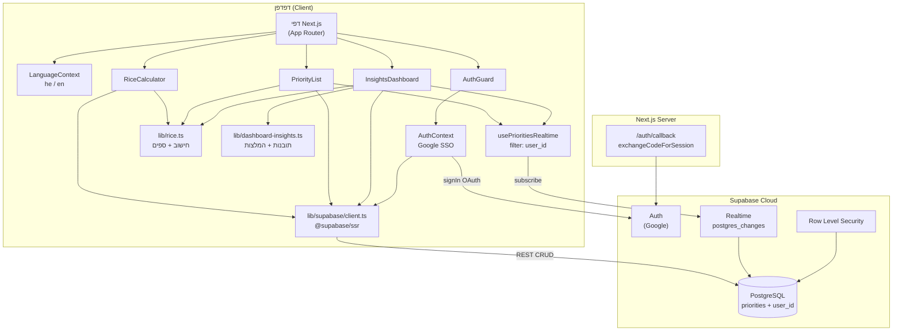

# PriorityMaster — תיאור הפרויקט להשקה

**PriorityMaster** היא אפליקציית ווב דו-לשונית (עברית RTL / אנגלית LTR) לתעדוף רעיונות ופיצ'רים לפי מסגרת **RICE** (Reach, Impact, Confidence, Effort). המוצר מאפשר לצוותי מוצר, פרודקט ופיתוח להזין הערכות מובנות, לקבל ציון מספרי אחיד, לשמור רשימת עדיפויות אישית (לפי משתמש מחובר) ולצפות בתובנות ויזואליות — בלי גיליונות מפוזרים ובלי ויכוחים סובייקטיביים בלבד.

---

## 1. ערך עסקי והבעיה שהאפליקציה פותרת

### הבעיה

צוותים שמנהלים Roadmap או Backlog נתקלים באותן קשיים:

- **עומס רעיונות** — יותר בקשות, פיצ'רים ותיקונים ממה שאפשר לבצע בזמן ובתקציב.
- **תעדוף לא עקבי** — כל אחד מדרג לפי תחושת בטן, לחץ מכירות או "מי צעק הכי חזק".
- **חוסר שפה משותפת** — קשה להשוות בין רעיון A לרעיון B כשאין מדדים מוגדרים.
- **החלטות שלא נשמרות** — חישובים ב-Excel או בפגישה נעלמים; אין מקום אחד לרשימה חיה ולעדכון כשהנתונים משתנים.

### הפתרון

PriorityMaster מיישמת את מסגרת **RICE** — מתודולוגיה מוכרת בתעשיית המוצר (למשל Intercom) — בצורה מונחית, עם ממשק דו-לשוני, שאלות מנחות וחיווי ויזואלי:

| יכולת | ערך לעסק |
|--------|-----------|
| **מחשבון RICE** | הערכה מובנית לכל רעיון: תפוצה, השפעה, ביטחון במספרים, מאמץ בחודשי-אדם → ציון אחד להשוואה. |
| **חיווי עדיפות** | ספים ברורים: נמוך (1–10), בינוני (11–29), גבוה (30+) — מקל לקבל החלטות בפגישות תעדוף. |
| **רשימת תעדוף** | כל הרעיונות שנשמרו למשתמש המחובר, ממוינים לפי ציון; עריכה ומחיקה (דסקטופ: טבלה, מובייל: כרטיסים). |
| **דאשבורד תובנות** | KPIs, התפלגות עדיפות, מטריצת Value vs Effort, התפלגות ביטחון, מדד יעילות (Impact÷Effort), וסיכום המלצות אוטומטי. |
| **מדריך כללי RICE** | שאלות מנחות, נרמולים ונוסחה — מפחית פערי ידע בין חברי צוות. |
| **התחברות (Google)** | כל משתמש רואה ושומר רק את הרשימה שלו (באמצעות `user_id` + RLS ב-Supabase). |
| **שפה** | עברית (ברירת מחדל) או אנגלית — כולל כיוון ממשק (RTL/LTR). |

### ערך עסקי מרכזי

1. **החלטות מבוססות נתונים (יחסית)** — לא מחליפים שיקול דעת אנושי, אלא מכניסים מסגרת ומספרים לפני שמקצים משאבים.
2. **שקיפות ושיתוף** — נתונים ב-Supabase; שינויים מתעדכנים בזמן אמת ברשימה ובדאשבורד (Realtime, מסונן לפי משתמש).
3. **מהירות תפעולית** — פחות זמן בגיליונות, יותר זמן בדיון על *מה* לעשות ולא *איך* לחשב.
4. **התאמה לשוק הישראלי** — עברית מלאה, RTL, עם אפשרות לעבור לאנגלית לצוותים בינלאומיים.

### קהל יעד

- מנהלי מוצר (PM) ומנהלי מוצר בכירים  
- צוותי R&D / פיתוח שמשתתפים בתעדוף  
- יזמים וסטארטאפים שבונים Roadmap ראשון  
- צוותים פנימיים שרוצים תהליך תעדוף קל וחוזר

---

## 2. סטאק טכנולוגי

### Frontend & אפליקציה

| טכנולוגיה | גרסה (בערך) | שימוש |
|-----------|-------------|--------|
| **Next.js** | 16.x | App Router, דפים, Route Handler ל-callback של Auth |
| **React** | 19.x | UI ורכיבי Client |
| **TypeScript** | 5.x | טיפוסים בכל הקוד |
| **Tailwind CSS** | 4.x | עיצוב, RTL/LTR, מצב כהה (dark), פריסה רספונסיבית |
| **shadcn/ui** + **Radix UI** | — | כפתורים, טבלאות, דיאלוגים, סליידרים, Sheet |
| **Framer Motion** | 12.x | אנימציות (תפריט, תוצאות, כרטיסים) |
| **Recharts** | 3.x | גרפים בדאשבורד (Bar אופקי/אנכי, Scatter) |
| **Lucide React** | — | אייקונים |
| **canvas-confetti** | — | חגיגה ויזואלית בציון גבוה (30+) במחשבון |

### Backend, Auth & נתונים

| טכנולוגיה | שימוש |
|-----------|--------|
| **Supabase** (PostgreSQL) | אחסון טבלת `priorities`, REST API, Realtime |
| **Supabase Auth** | התחברות Google (OAuth); session ב-cookies |
| **@supabase/supabase-js** | לקוח דפדפן — קריאה/כתיבה מה-Client |
| **@supabase/ssr** | לקוח דפדפן + שרת (cookies) ל-Auth callback |

> **הערה:** אין שרת API ייעודי של Next.js לנתוני RICE — הגישה ל-DB היא מהדפדפן דרך מפתח `anon` / session של משתמש מחובר ו-RLS. Route Handler יחיד: `/auth/callback` להחלפת קוד OAuth ל-session.

### i18n

| רכיב | שימוש |
|------|--------|
| **`src/i18n/`** | מילונים `he.ts` / `en.ts`, טיפוסים משותפים |
| **`LanguageContext`** | בחירת שפה, `document.documentElement.lang` / `dir` |
| **`useTranslation()`** | כל מחרוזות ה-UI — ללא טקסט קשיח ברכיבים |

### כלי פיתוח ופריסה

| כלי | שימוש |
|-----|--------|
| **Node.js** | ≥ 20.9 |
| **ESLint** + `eslint-config-next` | Lint |
| **Vercel** | פריסה (`vercel.json`: framework nextjs) |
| **Supabase Migrations** | סכמת DB והרשאות (`supabase/migrations/`) |

### משתני סביבה

```env
NEXT_PUBLIC_SUPABASE_URL=   # כתובת בסיס …supabase.co (בלי /rest/v1/)
NEXT_PUBLIC_SUPABASE_ANON_KEY=
```

קובץ דוגמה: `.env.example`. אחרי שינוי — הפעלה מחדש של `npm run dev` או build לפרודקשן.

**ב-Supabase Dashboard:** הפעלת Provider של Google ב-Authentication, והגדרת Redirect URL ל-`/auth/callback` בדומיין הפריסה.

---

## 3. ארכיטקטורה

### תצוגה כללית



### מבנה תיקיות (לוגי)

```
priority-master/
├── src/
│   ├── app/                      # דפים (App Router)
│   │   ├── page.tsx              # מחשבון RICE (/)
│   │   ├── list/page.tsx         # רשימת תעדוף
│   │   ├── dashboard/page.tsx    # דאשבורד תובנות
│   │   ├── rice-principles/      # מדריך RICE
│   │   ├── login/                # התחברות Google
│   │   ├── auth/callback/        # Route Handler — OAuth
│   │   └── layout.tsx            # Providers, AppShell
│   ├── components/
│   │   ├── rice-calculator.tsx
│   │   ├── priority-list.tsx
│   │   ├── insights-dashboard.tsx
│   │   ├── rice-principles-content.tsx
│   │   ├── app-shell.tsx         # סיידבר + תפריט מובייל (Sheet)
│   │   ├── app-sidebar.tsx
│   │   ├── sidebar-nav.tsx
│   │   ├── auth-guard.tsx
│   │   ├── login-form.tsx
│   │   ├── language-switcher.tsx
│   │   ├── metric-options-grid.tsx
│   │   └── ui/                   # רכיבי shadcn
│   ├── contexts/
│   │   ├── auth-context.tsx
│   │   └── language-context.tsx
│   ├── hooks/
│   │   └── use-priorities-realtime.ts
│   ├── i18n/
│   │   ├── dictionaries/he.ts, en.ts
│   │   ├── types.ts
│   │   └── index.ts
│   └── lib/
│       ├── rice.ts               # לוגיקת RICE טהורה
│       ├── dashboard-insights.ts # חלוקות ביטחון, ROI, המלצות
│       ├── score-tier-ui.ts      # חיווי מתוך מילון
│       ├── layout.ts             # מחלקות פריסה משותפות
│       └── supabase/             # client, server, env
└── supabase/migrations/          # סכמה + RLS + grants
```

### זרימת דפים (מוצר)

| נתיב | רכיב | תפקיד |
|------|------|--------|
| `/login` | `LoginForm` | התחברות Google (דף ציבורי) |
| `/auth/callback` | Route Handler | השלמת OAuth → הפניה לאפליקציה |
| `/rice-principles` | `RicePrinciplesContent` | הסבר מסגרת RICE, שאלות מנחות, נוסחה, ספי חיווי |
| `/` | `RiceCalculator` | הזנת רעיון, חישוב, שמירה ל-DB (דורש התחברות) |
| `/list` | `PriorityList` | רשימה ממוינת, עריכה (Sheet), מחיקה |
| `/dashboard` | `InsightsDashboard` | KPIs, גרפים, סיכום המלצות |

ניווט: `AppSidebar` בדסקטופ; במובייל — כפתור תפריט + `Sheet` עם `SidebarNav`. דפים מוגנים עוטפים ב-`AuthGuard` (מפנה ל-`/login` אם אין session).

### מודל הנתונים

**טבלה:** `public.priorities`

| עמודה | סוג | תיאור |
|--------|-----|--------|
| `id` | `uuid` | מזהה (ברירת מחדל: `gen_random_uuid()`) |
| `user_id` | `uuid` | מזהה משתמש Supabase Auth — נשמר בכל insert |
| `name` | `text` | שם הרעיון / הפיצ'ר |
| `reach` | `numeric` | תפוצה (1–10 באפליקציה) |
| `impact` | `numeric` | השפעה (0.25, 0.5, 1, 2, 3) |
| `confidence` | `numeric` | ביטחון באחוזים (0–100) |
| `effort` | `numeric` | מאמץ בחודשי-אדם (0.25–3) |
| `score` | `numeric` | ציון RICE מחושב (נשמר בעת insert/update) |

> **הערת סכמה:** הקוד מצפה לעמודת `user_id`. יש לוודא ב-Supabase שהעמודה קיימת ושמדיניות RLS מגבילה שורות ל-`auth.uid() = user_id`. מיגרציות ב-repo עשויות לדרוש עדכון ידני ב-SQL Editor אם הטבלה נוצרה לפני הוספת Auth.

### לוגיקת RICE (ליבה)

נוסחה כפי שמיושמת ב-`src/lib/rice.ts`:

```
מונה = Reach × Impact × (Confidence% ÷ 100)
ציון = מונה ÷ Effort
ציון מוצג = עיגול לספרה עשרונית אחת
```

**נרמולים ב-UI:**

- **Reach:** שלם 1–10 (סליידר; ב-RTL "רחב" משמאל).
- **Impact / Effort:** בחירה מערכים קבועים (`metric-options-grid`; לא רציף).
- **Confidence:** 0–100%; בנוסחה מומר לעשרוני; גרדיאנט ירוק→אדום על הסליידר.

**חיווי עדיפות (UI בלבד — לא משנה את הנוסחה):**

| ציון | רמה | משמעות תפעולית |
|------|-----|----------------|
| 30+ | גבוה ✅ | כדאי לבצע (כולל קונפטי במחשבון) |
| 11–29 | בינוני 🤔 | לשקול |
| 1–10 | נמוך ✖️ | לא לבצע כעת |

### דאשבורד — לוגיקת תובנות

מימוש ב-`insights-dashboard.tsx` + `lib/dashboard-insights.ts`:

- **KPI:** סה״כ רעיונות, רעיון עם הציון הגבוה ביותר ("ההבטחה הגדולה"), ביטחון ממוצע.
- **Bar chart — התפלגות עדיפות:** מספר רעיונות בכל אחת משלוש רמות הציון (לפי `scoreTier`).
- **Scatter — Value vs Effort:**
  - ציר X: `effort`
  - ציר Y: `Reach × Impact × Confidence` (מונה ללא חלוקה במאמץ)
  - רבעים לפי **חציון** מאמץ וחציון ערך: Quick Wins, Big Bets, Fill-ins, Time Wasters
  - Tooltip בפורטל (ללא חיתוך ב-Card)
- **Bar chart — התפלגות ביטחון:** ארבעה דליים — 100%, 80–99%, 50–79%, מתחת ל-50%.
- **Bar chart אופקי — מדד יעילות (ROI):** דירוג לפי `Impact ÷ Effort` (ללא Reach); עד 8 פריטים; פריסה מותאמת מובייל עם גלילה אופקית לתוויות ארוכות.
- **סיכום והמלצות:** עד 5 נקודות דטרמיניסטיות (ללא AI) — Quick Win, סיכון (מאמץ גבוה + ביטחון נמוך), הטיית ביטחון 100%, Big Bet מוביל, או הודעת איזון.

### Realtime

`usePrioritiesRealtime` נרשם ל-`postgres_changes` על `public.priorities` עם **סינון** `user_id=eq.{userId}`. בעת INSERT/UPDATE/DELETE — רשימה ודאשבורד טוענים מחדש את הנתונים.

> בפרויקט Supabase יש להפעיל Replication לטבלה `priorities`.

### אבטחה (מצב נוכחי והמלצות)

- **התחברות:** Supabase Auth — Google OAuth; session ב-cookies (`@supabase/ssr`).
- **הגנת דפים:** `AuthGuard` מפנה משתמשים לא מחוברים ל-`/login`.
- **RLS:** מופעל על `priorities`. מיגרציה `20260514140000_priorities_anon_grants.sql` מעניקה מדיניות `priorities_allow_all` — מתאים ל**פיתוח / דמו**.
- **לפני השקה ציבורית:**
  - הוספת/אימות עמודת `user_id` והגבלת SELECT/INSERT/UPDATE/DELETE ל-`auth.uid() = user_id`
  - הגדרת מדיניות RLS per-user והסרת גישה אנונימית פתוחה
  - הגדרת Redirect URLs ו-Google OAuth ב-Supabase

### פריסה

1. **Frontend:** Vercel — `npm run build` / `next start`.
2. **DB:** Supabase — הרצת מיגרציות + עדכון RLS ו-`user_id` לפי הצורך.
3. **Env ב-Vercel:** `NEXT_PUBLIC_SUPABASE_URL`, `NEXT_PUBLIC_SUPABASE_ANON_KEY`.
4. **Auth:** Redirect URL: `https://<domain>/auth/callback`

---

## סיכום להשקה

**PriorityMaster** היא כלי תעדוף מוצר ממוקד: התחברות → מחשבון RICE → שמירה אישית → רשימה ממוינת → דאשבורד תובנות עשיר, בעברית או באנגלית ועם עדכון חי. הערך העסקי הוא **תעדוף עקבי, שקוף ומהיר**; הסטאק הוא **Next.js + React + Supabase (Auth + DB + Realtime)**; הארכיטקטורה היא **Client-heavy** עם לוגיקת RICE ב-`lib/rice.ts`, תובנות ב-`lib/dashboard-insights.ts`, ונתונים מרכזיים ב-PostgreSQL.

### פקודות מהירות

```bash
cd priority-master
npm install
cp .env.example .env.local   # ערכו מפתחות Supabase
npm run dev                  # http://localhost:3000
npm run build && npm start   # פרודקשן מקומי
```

---

*מסמך זה נכתב על בסיס קוד המקור בפרויקט `priority-master` — מאי 2026.*
